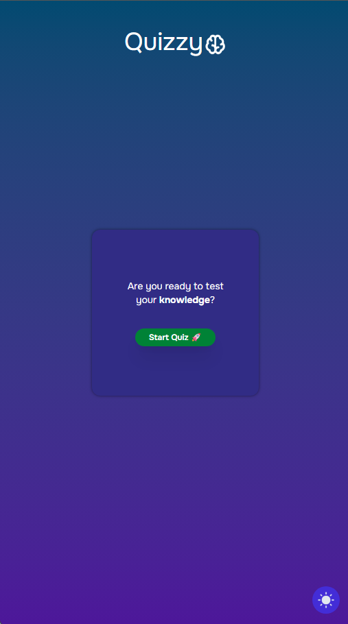
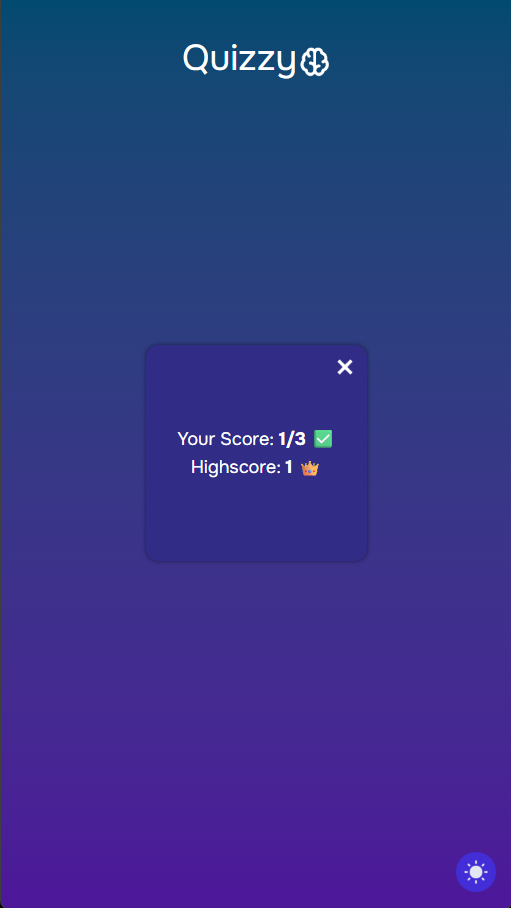

# Interactive Quiz App
A clean and responsive quiz interface built with Vanilla JavaScript, HTML5, and Tailwind CSS. Test your knowledge, save your high score, and switch between light and dark modes.

## Screenshots
Here's the quiz in action, showcasing the start screen, a question in progress, and the final results page.

## Features
**Dynamic Questions:** The quiz loads questions and answers dynamically from a JavaScript array.

**Answer Validation:** Users get immediate visual feedback after locking in an answer (green for correct, red for incorrect).

**High Score System:** The highest score is saved to the browser's localStorage, persisting between sessions.

**Dark Mode:** A fully functional dark mode that remembers the user's preference in localStorage.

**Responsive Design:** The UI is fully optimized for both desktop and mobile devices.

**Clean Code Structure:** The code is modular, using functions for state management (setUIState) and logic reuse (resetQuestionUI).

## Built With
**HTML5:** For the semantic structure of the application.

**Tailwind CSS:** For rapid and modern styling of UI components.

**Vanilla JavaScript (ES6+):** For all the quiz logic, event handling, and DOM manipulation.

## Code Structure (Overview)
The JavaScript file is organized into logical sections for better readability and maintainability:

**Element Selections:** All DOM elements are selected once at the top.

**State Variables:** Variables like currentQuestionIndex and score manage the quiz's state.

**setUIState(state):** A central function that controls the visibility of different sections (start, quiz, result), ensuring clean UI logic.

**lockAnswer():** Checks the selected answer, provides visual feedback, and updates the score.

**prepareNextQuestion() & resetQuestionUI():** Ensure a smooth transition to the next question and reset UI elements to their default state.
